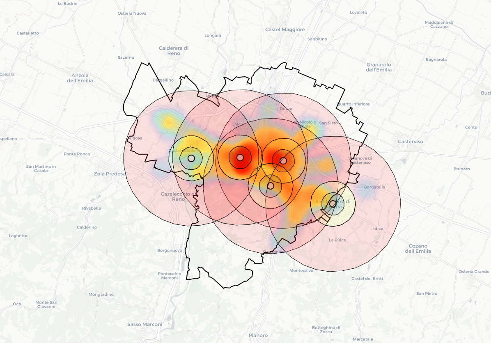

# Bologna-Traffic-Air-Pollution-Analysis

<h1 align="center">Spatiotemporal Analysis of Traffic-Induced Air Pollution in Bologna</h1>
<h3 align="center">Geospatial Analysis and Representation for Data Science</h3>

<div align="center">
<a href="https://github.com/isaaclucky/bologna_geospatial/network/members"></a>
<a href="https://github.com/isaaclucky/bologna_geospatial/pulls"></a>
<a href="https://github.com/isaaclucky/bologna_geospatial/issues"></a>
<a href="https://github.com/isaaclucky/bologna_geospatial/graphs/contributors"></a>
<a href="https://github.com/isaaclucky/bologna_geospatial/blob/main/LICENSE"></a>
</div>

</br>

<p align="center">
  
</p>

## 📋 Abstract

This study investigates the spatiotemporal patterns of traffic-related air pollution in Bologna, Italy, employing multi-scale geospatial analysis to identify critical traffic hotspots and evaluate the differential impacts of vehicle types on air quality across urban zones. By integrating high-resolution traffic monitoring data from Bologna's sensor network with air quality measurements (NO2, PM10, PM2.5), we reveal pronounced spatial heterogeneity in traffic burden and complex temporal dynamics in pollution response.

**Key Results:**
- Central zones experience traffic densities exceeding 30,000 vehicles/km²
- Heavy vehicles (7-8% of traffic) contribute disproportionately to NO2 levels
- Traffic impacts show rapid distance decay: 50% reduction at 750m from source
- Weekend traffic reductions (20%) yield only 16% NO2 decrease

## 🎯 Research Objectives

1. **Quantify** the spatial distribution of traffic-induced air pollution across Bologna's urban zones
2. **Analyze** temporal patterns in traffic flow and their correlation with air quality metrics
3. **Assess** the differential impact of vehicle types (light, medium, heavy) on pollution levels
4. **Develop** a distance-weighted impact model for traffic emissions
5. **Identify** priority areas for targeted traffic management interventions

## 📊 Data Sources

| Data Type | Source | Temporal Resolution | Spatial Coverage |
|-----------|--------|-------------------|------------------|
| **Traffic Data** | [Bologna Municipality Open Data Portal](https://opendata.comune.bologna.it/explore/dataset/rilevazione-flusso-veicoli-tramite-spire-anno-2024) | Hourly | 300+ sensors citywide |
| **Regional Traffic** |[ Sistema MTS Emilia-Romagna](https://datacatalog.regione.emilia-romagna.it/catalogCTA/dataset/sistema-mts-flussi-di-traffico-al-quarto-d-ora/resource/4fd43601-40ef-4024-b1df-676d47c0856c) | 15-minute | Major arterial roads |
| **Air Quality** | [ARPAE Emilia-Romagna](https://dati.arpae.it/) | Hourly (NO2), Daily (PM) | 5 monitoring stations |
| **Geospatial** | OpenStreetMap, Bologna Municipality | Static | Full municipal boundary |
| **Zone Boundaries** |[ Bologna Open Data](https://opendata.comune.bologna.it/explore/dataset/zone-del-comune-di-bologna/information/) | Static | 18 administrative zones |
| **ZTL Zones Data**| [Bologna Open Data](https://opendata.comune.bologna.it/explore/dataset/zona-a-traffico-limitato)| shapefile | |

## 🗂️ Project Structure

```
Bologna-Traffic-Air-Pollution-Analysis/
│
├── 📁 data/
│   ├── traffic_data/                    # traffic related datasets
│   ├── geostat_data/            # Shapefiles and spatial data
│   └── land_use/             
│
├── 📁 notebooks/
│   ├── 01_data_collection.ipynb
│   ├── 02_vehicle_type_modeling.ipynb
│   ├── 03_data_preparation.ipynb
│   └── 04_data_analysis.ipynb
│
├── 📁 scripts/
│
├── 📁 pictures/
│   ├── figures/                # Generated plots and maps
│   ├── tables/                 # Statistical summaries
│   └── reports/                # Analysis reports
│
├── requirements.txt
├── README.md
└── LICENSE
```

## 🚀 Installation & Setup

### Prerequisites
- Python 3.11+
- Jupyter Notebook/Lab

### Installation Steps

```bash
# Clone the repository
git clone https://github.com/isaaclucky/bologna_geospatial.git
cd bologna_geospatial

# Create a virtual environment
python -m venv venv
source venv/bin/activate  # On Windows: venv\Scripts\activate

# Install dependencies
pip install -r requirements.txt

```

## 🔧 Usage


### Jupyter Notebooks
Navigate through the notebooks in sequential order:
1. Extract the Zipped files.
2. Start with `01_data_collection.ipynb` to understand data collection
3. Evaluate modelling in `02_vehicle_type_modeling.ipynb`
4. Deep dive into data preprocessing with `03_data_preparation.ipynb`
5. Investigate spatial and temporal patterns in `04_data_analysis.ipynb`

## 🔬 Methodology Highlights

### Buffer Zone Analysis
- **Zone 1**: 0-0.75 km (weight: 1.0)
- **Zone 2**: 0.5-1.5 km (weight: 0.5)
- **Zone 3**: 1.5-3.0 km (weight: 0.33)

### Vehicle Type Classification
- **Light**: < 3.5 tonnes (weight factor: 1.0)
- **Medium**: 3.5-7.5 tonnes (weight factor: 2.5)
- **Heavy**: > 7.5 tonnes (weight factor: 4.0)

### Key Analytical Techniques
- Spatial autocorrelation analysis 
- Time series decomposition (STL)
- Distance-weighted interpolation
- Cross-correlation analysis for lag effects

## 📈 Key Findings

### Spatial Patterns
- **Traffic Hotspots**: Marconi (31,668 v/km²), Irnerio (30,257 v/km²), Malpighi (22,645 v/km²)
- **Low Traffic Zones**: Colli (309 v/km²), Corticella (940 v/km²), Lame (639 v/km²)
- **NO2 Gradient**: 28.4 μg/m³ (Marconi) to 15.7 μg/m³ (Barca)

### Temporal Dynamics
- **Rush Hour Peaks**: 8:00 AM (39,165 vehicles/hour), 6:00 PM (peak)
- **Weekend Reduction**: -20.4% Sunday, -16.2% Saturday
- **Heavy Vehicle Timing**: Peak at 9-11 AM (8.8% of traffic)

## 🛠️ Technical Stack

- **Data Processing**: Python, Pandas, NumPy
- **Geospatial Analysis**: GeoPandas, Shapely, GDAL
- **Visualisation**: Matplotlib, Seaborn, Folium, Plotly
- **Statistical Analysis**: SciPy, Statsmodels
- **Machine Learning**: Scikit-learn

## 👤 Author

**Yishak Tadele Nigatu**
- University of Trento, Italy
- Email: yishaktadele.nigatu@studenti.unitn.it
- GitHub: [@isaaclucky](https://github.com/isaaclucky)
- LinkedIn: [Yishak Tadele](https://www.linkedin.com/in/yishak-tadele/)

## 🤝 Contributing

Contributions are welcome! Please feel free to submit a Pull Request.


## 🙏 Acknowledgments

- **Bologna Municipality** for providing open access to traffic monitoring data
- **ARPAE Emilia-Romagna** for air quality measurements
- **Professor Diego Giuliani** For Project Supervision and Academic Guidance
- **Maurizio Napolitano** For Project Supervision and Academic Guidance
- **University of Trento** 
- **OpenStreetMap contributors** for geospatial data

---

⭐ If you find this analysis helpful, please consider giving it a star!
